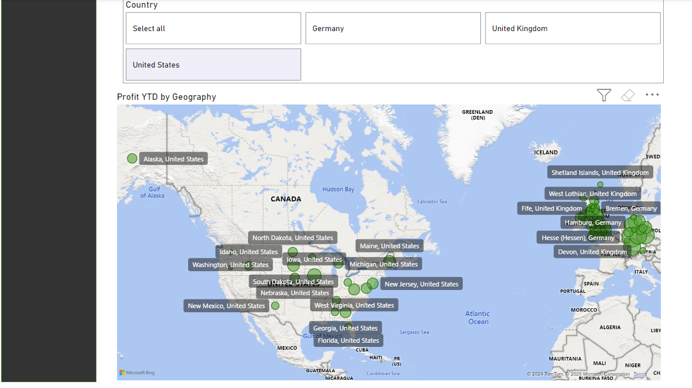

# data-analytics-power-bi-report815

## Importing the data into Power Bi 

### The dataset consists of 4 tables: An Orders fact table, and dimension tables for Products,Stores and Customers. 

The first stage of this project involved data loading and preparation.
- Firstly, a conncection was made to an Azure SQL database to import the orders_powerbi table.
- Then, the Products dimension table was iported as a csv file.
- Next, a conncection was made to an Azure storage account to import the Stores table.
- Finally, the customers file was unzipped and the 3 files were imported in combinationas the customers table.
- All these 4 tables were then transformed in the Power Query editor to remove any duplicates, unecessary columns, missing values and ensure the column names adhere to Power Bi naming conventions.

## Creating the Data Model

The next stage involved constructing the data model for the project

### Task 1: Making the data table

First, a date table was made to make use of the time intelligence functions. This table runs from the start of the year containing the earliest date in the Orders['Order Date'] column to the end of the year containing the latest date in the Orders['Shipping Date'] column. The DAX formula used to make this table is shown below :

```dax 
Dates = CALENDAR(DATE(2010,1,27),DATE(2023,6,28))
```
Then DAX formulas were used to create the following columns in the date table:

  -Day of Week
  -Month Number 
  -Month Name
  -Quarter
  -Year
  -Start of Year
  -Start of Quarter
  -Start of Month
  -Start of Week

### Task 2: Building the star schema data model

The next step was creating relationships between the tables to form the start schema. The relationships made were:
  - Products[product_code] to Orders[product_code]
  - Stores[store code] to Orders[Store Code]
  - Customers[User UUID] to Orders[User ID]
  - Date[date] to Orders[Order Date]
  - Date[date] to Orders[Shipping Date]

Below is a screenshot of the star schema model from the Power BI file:


### Task 3: Creating a measures table

Creating a separate table for measures is a best practice that will help us keep our data model organized and easy to navigate. This table was created in the data Model view with the Power Query Editor.

### Task 4 : Creating the key measures

This step involves creating some of the key measures that will be used in this report. These are shown below:

- A measure called Total Orders that counts the number of orders in the Orders table
```dax
Total Orders = COUNTROWS(Orders)```


- A Measure called Total Revenue that multiplies the Orders[Product Quantity] column by the Products[Sale_Price] column for each row, and then sums the result
```dax
Total Revenue = SUMX(Orders,Orders[Product Quantity]*RELATED(Products[Sale Price]))```

- A measure called Total Profit that calculates the profit for each order and then sums the result for all rows :
```dax
Total Profit = SUMX(Orders,Orders[Product Quantity]*(RELATED(Products[Sale Price])-RELATED(Products[Cost Price])))```

- A measure called Total Customers that counts the number of unique customers in the Orders table. 
```dax
Total Customers = DISTINCTCOUNT(Orders[User ID])```

- A measure called Total Quantity that counts the number of items sold in the Orders table
```dax
Total Quantity = SUM(Orders[Product Quantity])```

- A measure called Profit YTD that calculates the total profit for the current year
```dax
Profit YTD = TOTALYTD([Total Profit],Orders[Order Date])```

- A measure called Revenue YTD that calculates the total revenue for the current year
```dax
Revenue YTD = TOTALYTD([Total Revenue],Orders[Order Date])```

### Task 5: Create Date and Geography Hierachies

A date hierachy was made with the following levels:
- Start of Year
- Start of Quarter
- Start of Month
- Start of Week
- Date

Additionally, a geography hierachy was made with the following levels:
- World Region
- Country
- Country Region

## Building the Customer Details Page

In this step, a report page was created to focus on customer-level analysis.

### Task 1:Creating Headline Card Visuals

Card Visuals were created for total distinct customers and revenue per customer:

- Firstly, two rectangle shaped were inserted as the bacground for the visuals.
- A card visual was then created for the [Total Customers] measure. This was renamed as 'Unique Customers'.
- Next, a new measure called [Revenue per Customer] was added to the Measures Table and a card visual was created for this

### Task 2: Creating the Summary Charts

- A Donut Chart visual showing the total customers for each country was made. This was done by using the Customers[Country] column to filter the [Total Customers] measure

- A second Donut Chart visual was made, using the Products[Category] column to filter the [Total Customers] measure. This shows the number of customers who purchased each product category.

### Creating a line chart of the weekly distinct customers

-Here, a Line Chart visual was added to the top of the page. It shows [Total Customers] on the Y axis, and uses the Date Hierarchy for the X axis. It allow users to drill down to the month level, but not to weeks or individual dates.

-A trend line was added, in additon to a forecast line for the next 10 periods with a 95% confidence interval

### Task 4: Creating the Top 20 Customers Table

-A new table was created, which displays the top 20 customers, filtered by revenue. The table shows each customer's full name, revenue, and number of orders.

- Additional conditional formatting was added to the revenue column, in order to display data bars for the revenue values

### Task 5: Creating the Top Customer Cards

- New measures were created for the [Name of the Top Customer],[Orders made by Top Customer] and [Revenue made by Top Customer]. The DAX formula is shown below:

```dax 
Name of Top Customer = TOPN(1, VALUES(Customers[Full Name]), [Total Revenue], DESC),
Orders made by Top Customer = CALCULATE([Total Orders],TOPN(1,VALUES(Customers[Full Name]),[Total Revenue],DESC)),
Revenue made by Top Customer = CALCULATE([Total Revenue],TOPN(1,VALUES(Customers[Full Name]),[Total Revenue],DESC))
```

- A set of three card visuals were added.These provide insights into the top customer by revenue. They display the top customer's name, the number of orders made by the customer, and the total revenue generated by the customer.

### Task 6: Add a Date Slicer

Finally, a date slicer was added to allow users to filter the page by year.

Below is a screenshot of the finished report page:


## Building the Executive Summary Page

A report page was created for the high-level executive summary. The purpose of this page is to give a n overview of the company's performance as a whole, so that C-suite exceutives can quickly gather insights and check outcomes against key targets.

### Task 1: Creating card Visuals

- Card visuals were made for the Total Revenue, Total Orders and Total Profit measures. 
- The Callout values were formatted so that only 2 decimals places are shown for the Total Profits and revenue and 1 decimal place for the Total Orders.
- The 3 Card Visuals were arranged so they span half the width of the page

### Task 2: Adding a Revenue Trending Line Chart

- A line chart was made with the x-axis set to the date hierachy and y-axis set to the Total Revenue. 
- This chart was positioned below the card visuals.

### Task 3: Adding Donut Charts for Revenue by Country and Store Type

- A pair of donut charts were cretaed, showing Total Revenue broken down by Store[Country] and Store[Store Type] respectively.

### Task 4: Adding a Bar Chart of Orders by Product Category

- A clustered bar chart was made with Total Orders on the x axis and Product Category on the y axis.
- The chart was then formatted with an approriate colour theme

### Task 5: Adding KPI Visuals

- New measures were created for:
  - Previous Quarter Profit
    ```dax
    Previous Quarter Profit = CALCULATE([Total Profit],PREVIOUSQUARTER(Dates[Date]))
    ```
  - Previous Quarter Revenue
    ```dax
    Previous Quarter Revenue = CALCULATE([Total Revenue],PREVIOUSQUARTER(Dates[Date]))
  - Previous Quarter Orders
   ```dax
   Previous Quarter Orders = CALCULATE([Total Orders],PREVIOUSQUARTER(Dates[Date]))
   ```
  - Targets, equal to 5% growth in each measure compared to the previous quarter

- A KPI was then made for the revenue:
  - The Value field was set to the Total Revenue
  - The Trend Axis was set to the Start of Quarter
  - The Target was set to the Target Revenue

- In the Format pane, with the Trend axis set to On, the following values were set:
  - Direction : High is Good
  - Bad Colour : red
  - Transparency : 15%

- This was repeated for the Profit and Orders cards with the approriate values

- The 3 KPI visuals were then arranged below the revenue trending line Chart

-A screenshot of the finished report page is shown below:


## Creating the Product Detail Page

The purpose of this page is to provide an in depth look into which products within the inventory are performing well, with the option to filter by category and region.

### Task 1: Adding Gauge Visuals

The first step is to add a set of three gauges, showing the current-quarter performance of Orders, Revenue and Profit against a quarterly target.

- DAX measures were created for the current quarterly Revenue,Orders and Profits.
- Measures were then also made for the quarterly targets for each metric and then for the gap between the target and performance measures.
- Three gauge filters were created, and assigned to the relevant measures. In each case, the maximum value of the gauge was set to the target, so that the gauge shows as full when the target is met.
- Conditional formatting was then applied to the callout value, so that it shows as red if the target is not yet met, and black otherwise.
- The gauges were arranged so they were spaced evenly at the top right of the page.

### Planning out the Filter State Cards

- Two rectangle shapes were added as placeholders for the cards which will show the filter state.
- The following measures were then defined to reflect the filter state of the card:
   
   ```dax
   Category Selection = IF(ISFILTERED(Products[Category]), SELECTEDVALUE(Products[Category], "No Selection"), "No Selection")`
   Country Selection = IF(ISFILTERED(Stores[Country]), SELECTEDVALUE(Stores[Country],"No Selection")`
   ```
- Card visuals were then added to each of the rectangles, and assigned one of these measures to each of them. 
- The cards were formatted to be the same size as the gauges, and the text was centred.

### Task 3: Adding an Area Chart of Revenue by Product Category

- An area chart was added that shows how the different product categories are performing in terms of revenue over time.
- The following fields were et:
  
  X axis as Dates[Start of Quarter]
  Y axis values as the Total Revenue
  Legend as Products[Category]

- The chart was arranged on the left of the page, extending to level with the start of the second gauge visual.

### Adding a Top Products Table

A top 10 products table was added underneath the area chart with the following fields:
- Product Description
- Total Revenue
- Total Customers
- Total Orders
- Profit per Order

### Adding a Scatter Graph of Qauntity Sold vs Profit per items

The products team want to know which items to suggest to the marketing team for a promotional campaign. They want a visual that allows them to quickly see which product ranges are both top-selling items and also profitable.
A scatter graph would be ideal for this job.

- Firstly, a new calculated column was created called [Profit per Item] in the Products table using this DAX formula:

``` dax
Profit per Item = Products[Sale Price] - Products[Cost Price]
```

- A new Scatter chart was added to the page, and configured as follows:

  Values as Products[Description]
  X-Axis as Products[Profit per Item]
  Y-Axis as Orders[Total Quantity]
  Legend as Products[Category]

### Task 6: Creating a Slicer Toolbar

- Slicers allow users to control how the data on a page are filtered. However, adding multiple slicers can clutter up the layout of the report page.
- A professional-looking solution to this issue is to use Power BI's bookmarks feature to create a pop-out toolbar which can be accessed from the navigation bar on the left-hand side of the report.
- First, a new blank button was added tot he top of the navigation bar, with the tooltip text set to 'Open Slicer Panel'
- Next, a new rectangle shape was added over the naviagtion bar and brought to the top of the stacking order in the Selection Pane.
- A Products[Category] and Store[Region] Vertical List slicer were then added and grouped to the rectangle slicer toolbar shape.
- A 'Back' button was then added so that we can hide the slicer toolbar when not in use.
- Two new bookmarks were added : one with the toolbar group hidden in the Selection pane, and one with it visible. 
- These were named 'Slicer Bar Closed' and 'Slicer Bar Open'. 
- Finally the actions were assigned on each button to the appropriate bookmark

Below are screenshots of the finished Products Detail Page:

Products page with Slicer Bar Closed: 
Products page with Slicer Bar Open: 

## Creating the Stores Map Page

The regional managers have requested a report page that allows them to see which stores are most profitable and on track to reach their quarterly revenue and profit targets. The best way to achieve this is by creating a map visual.

### Task 1: Adding the Map Visual

- On the Stores Map page, a new map visual was created that spans the majority of the page.
- The Geography hiereachy was set to the Location field and the ProfitYTD to the Bubble size field.
- The controls of the map were set as follows:

  Show Labels: On
  Auto-Zoom: On
  Zoom buttons: Off
  Lasso button: Off

### Task 2: Adding a Country Slicer

A slicer was added above the map, with the field set to Stores[Country], the slicer style as Tile and the Selection settings to Multi-select with Ctrl/Cmd and  "Select All" as an option.

Below is a screenshot of the finished Srores Map Page:


### Task 3: Creating a Stores Drillthough Page

To make it easy for the region managers to check on the progress of a given store, a drillthrough page was created that summarises each store's performance. This includes following visuals:

- Firstly, a new page named Stores Drillthrough was created.The Page type was set to Drillthrough and  'Drill through when' was set as 'Used as category'.'Drill through from' was set to country region.

The following visuals were added to the page:

- A table showing the top 5 products based on Total Orders, with columns: Description, Profit YTD, Total Orders, Total Revenue
- A column chart showing Total Orders by product category for the store
- Gauges for Profit YTD against a profit target of 20% year-on-year growth vs. the same period in the previous year. The target should use the Target field, not the Maximum Value field, as the target will change as we move through the year.
- A Card visual showing the currently selected store

A screenshot of the Stores Drillthough page is shown below:


### Task 4: Creating a Stores Tooltip Page

A custom tooltips page was created so that users will be able to see each store's year-to-date profit just by hovering the mouse over a store on the map.

- This was done by creating a new page and adjusting the page type to Tooltip under the Page Information card in the Format Pane. The Profit Gauge from the Stores drillthough page was copied over.


- Finally, the tooltip of map visual was set to the tooltip page that was just created.


